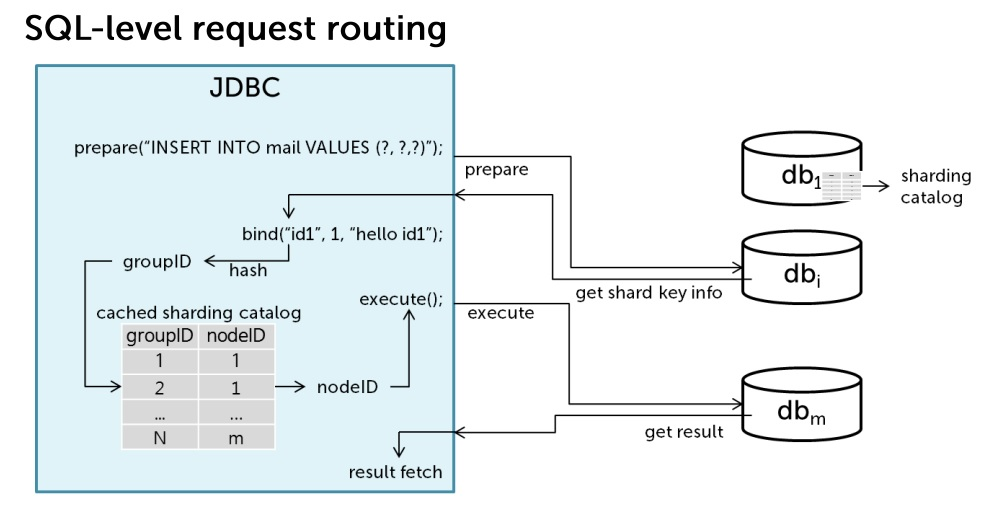
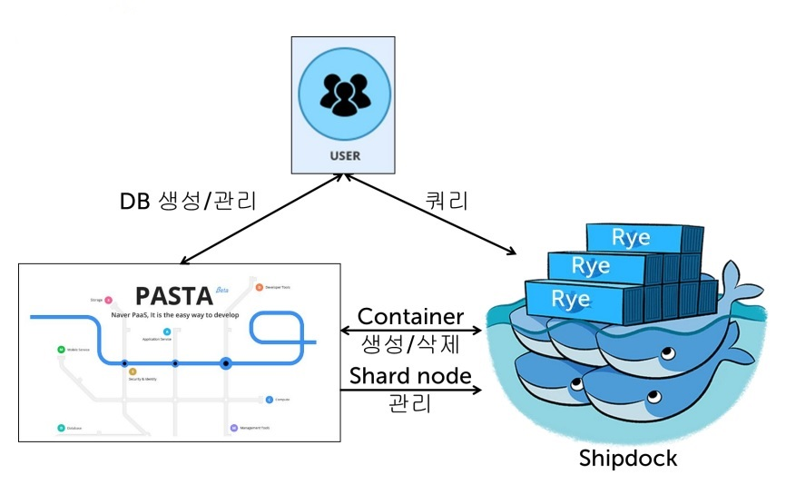
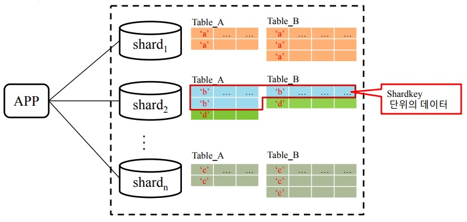

Rye 소개
===========

Rye는 인터넷 서비스를 위한 응답성과 편의성을 갖춘 분산 관계형 데이터베이스 관리 시스템으로 개발되었다. 다음은 Rye의 주요 특징이다.

- 응답성
	- 유연한 부하 분산 및 스키마 변경
	- 고성능, 고가용성
- 개발 및 운영 편의성
	- 관계형 스키마, SQL 지원
	- 표준 프로그래밍 인터페이스 제공 (JDBC)
	- SQL 자동 분산, 트랜젝션 지원

이 장에서 설명하는 내용은 다음과 같다.

-   인터넷 서비스의 특성
-   데이타 저장소에서 발생하는 이슈
-   Rye: Native Sharding RDBMS
-   Rye 에 적용된 기술
-   SQL 예제
-   Rye Vision & Technical Direction
-   시스템 구조

인터넷 서비스의 특성
-----------------

- 사용자가 폭발적으로 늘어날 수 있고 사용자 요구에 따른 기능 변경이 꾸준히 발생한다.
- 위를 포함한 어떠한 상황(OS 패닉, H/W 장애, 네트워크 단절 등)에서도 사용자에게 일정한 응답성을 보장해야 한다.

데이타 저장소에서 발생하는 이슈
--------------------------

- 부하 분산을 위한 데이타 저장소의 수평적 확장이 용이해야 함
- 스키마 변경에 유연하게 대처할 수 있어야 함
- 데이타에 대한 효율적인 검색 및 정합성을 보장해야 함

Rye: Native Sharding RDBMS
--------------------------

다음은 인터넷 서비스의 데이타 저장소로서 Rye가 지원하려는 대상들이다.

- 사용자에게 일정한 응답성을 보장하면서 데이타를 분산하고 스키마를 변경한다.
- 개발자에게 친숙한 표준화 된 프로그래밍 방식을 제공한다.
- SNS, 메일 같은 대용량의 개인화 서비스 저장소로 사용하는데 적합하다.
- Complete platform for sharding an RDB

Rye는 샤딩(sharding)이라는 기술을 이용하여 관계형 DB를 수평적으로 확장(scale-out)하며, DB를 사용하는 응용은 샤딩 여부를 알 필요가 없다. Rye는 샤드 노드라 불리는 논리적 파티션 여러 개에 데이터를 분산한다. 샤드 노드는 HA로 구성되어 동일한 데이타 셋을 가지는 여러 대의 서버로 구성된다. 데이터의 크기가 커지거나 샤드 노드 클러스터의 크기를 키우거나 줄일 때 Rye는 리밸런스(rebalance) 작업을 수행하여 데이터가 샤드 노드 클러스터 전체에 잘 분배가 되도록 한다. 샤딩을 통해 DB 서버군 전체가 서버 한대의 RAM 크기나 디스크 I/O의 제한을 벗어난 규모로 커질 수 있으며, 서버 규모 확장을 위해 DB를 사용하는 응용을 변경할 필요가 없다.

Rye는 해시기반 샤딩 방법을 지원한다.

사용자는 다음 상황에서 샤드 노드 클러스터 구성을 고려할 수 있다.
* RAM 제한: 시스템에서 자주 접근하는 페이지와 인덱스를 더한 크기가 장비에서 사용할 수 있는 최대 RAM 용량을 넘어서는 경우
* Disk I/O 제한: 시스템 I/O 대역폭의 제한으로 변경 내역을 빠르게 Disk로 비우지 못하는 경우
* 저장용량 제한: 데이터가 단일 장비의 저장 장치 용량을 초과하는 경우

Rye는 사용자가 자신의 데이타를 어떻게 샤딩하려는지, 전체 시스템이 어떠한 노드들로 구성되어 있는지, HA 설정이 어떻게 되어있는지와 같은 분산 시스템 유지에 필요한 설정들을 DB 메타 정보로 관리하기 때문에 타 제품과 비교할 때 다음의 물음에서 차이점이 있다.

- SQL만 작성하면 분할된 데이터를 찾아 갈 수는 없나?
- Shardkey 단위의 QPS가 작기 때문에 shardkey로 동시성을 제어하면 전체 QPS를 더 올릴 수 있지 않을까?
- 샤드된 데이터의 정합성은 어떻게 보장하지?
- 많은 서버를 어떻게 관리하지?
- 이중화는 편리하게 할 수는 없을까?
- 스키마 변경 작업을 서비스 영향없이 할 수 있는가?
- 스키마 변경 작업을 전체 노드에 일괄 처리 할 수 있는가?

Rye 에 적용된 기술
----------------

- 분산된 노드 관리 및 SQL 자동 분산
- 응답성과 리소스 사용량을 해치지 않는 online 인덱스 생성
- 새로운 잠금(lock) 방식 도입
- HA, 병렬(parallel) 복제
- 고성능 write-intensive workload 처리
- 인덱스 최적화

SQL 예제
-------------

#### 테이블 생성: 테이블 생성시 샤드 키 컬럼을 지정

``` sql
CREATE SHARD TABLE mail (
   	uid  	VARCHAR,
   	mid  	INT,
   	title 	VARCHAR,
   	PRIMARY KEY (uid, mid)
) SHARD BY uid;
```

#### 쿼리: 지정된 샤드 키 컬럼 정보를 활용하여 입력값에서 샤드 키값을 추출하여 자동 분산 처리

``` sql
INSERT INTO mail VALUES ('id1', 1, 'hello user1');
COMMIT;
INSERT INTO mail VALUES ('id2', 2, 'hello user2');
COMMIT;
INSERT INTO mail VALUES ('id3', 3, 'hello user3');
COMMIT;
INSERT INTO mail VALUES ('id4', 4, 'hello user4');
COMMIT;
INSERT INTO mail VALUES ('id5', 5, 'hello user5');
COMMIT;

-- already consist of 3 shard nodes
SELECT shard_nodeid(), count(*) FROM mail;
```
```
   shard_nodeid()   count(*)   
 ==============================
   1                2          
   2                2          
   3                1          
```

``` sql
-- query with shardkey condition
SELECT title FROM mail WHERE uid = 'id1';
```
```
   title           
 ==================
   'hello user1'   
```

``` sql
-- query with non-shardkey condition
SELECT title FROM mail WHERE mid < 3;
```
```
   title           
 ==================
   'hello user1'   
   'hello user2'   
```

Rye Vision & Technical Direction
--------------------------------

* Rye Vision
 * Relational paradigm, Distributed processing, Commodity hardware, Elasticity and Cloud/hybrid flexibility
* Technical Direction
 * High-speed, In-memory computing, SSD
 * Automated data distribution, Scale-out architecture
 * Fixed stable schema, Online schema change
 * SQL and ACID support
 * High availability and Reliability
 * Open-source software

시스템 구조
-----------

Rye는 논리적으로 하나 이상의 노드로 전체 시스템을 구성한다. 각 노드는 하나 이상의 물리 장비( 또는 가상 장비, 도커 컨테이너)로 구성된다. 노드를 추가/삭제하고 리밸런스 연산을 수행하여 데이터를 분산하거나 모을 수 있다. Rye는 질의를 분석해서 자동으로 분산해서 처리하기 때문에 사용자는 현재의 노드 개수와 상관 없이 항상 하나의 데이타베이스에 접속한 것과 동일하게 질의를 처리할 수 있다.



Rye는 클라우드로 데이터베이스 시스템을 구성하는데 매우 용이하게 설계되었다. 다음은 Rye로 RDS 서비스를 제공하는 예시이다.



데이타를 분산하는 단위의 크기는 다음과 같다.

* 샤드키 < 그룹 < 노드

### 샤드키(shardkey)

샤드키는 사용자가 데이타를 분산하기 위해 지정하는 칼럼의 값이다. 예를 들어, 사용자가 userID 칼럼으로 데이타를 분산하기로 한다면 userID 칼럼에 저장되는 값이 샤드키가 된다.



샤드키는 데이타 동기화를 위한 잠금(lock)의 단위로 사용된다.

### 그룹

그룹은 논리적으로 샤드키의 집합이다. 그룹의 총 개수는 시스템을 초기화 단계에서 설정해 준다. 시스템이 운영되기 시작하면 그룹의 총 개수를 변경할 수 없다. 샤드키를 해시하면 그에 대응하는 그룹 ID 를 얻을 수 있다. 해시 함수는 시스템 내부에 정의되어 있다.

```
groupID = hash (shardkey)
```

그룹은 데이타 분산을 위한 단위로 사용된다.

### 노드

노드는 논리적으로 그룹의 집합이다. 각 그룹은 현재 시스템을 구성하고 있는 임의의 노드로 대응된다. 전체 그룹은 균질하게 전체 노드로 분산될 수 있도록 내부 시스템 카탈로그로 관리된다. 리밸런스 연산을 이용해서 그룹은 다른 노드로 옮겨갈 수 있다.
```
+---------+--------+
| groupID | nodeID |
+---------+--------+
| 1       | K      |
+---------+--------+
| 2       | K      |
+---------+--------+
| ...     | ...    |
+---------+--------+
| N       | M      |
+---------+--------+
```

노드는 물리적으로 하나 이상의 인스턴스로 구성된다.

### 인스턴스

인스턴스는 물리적으로 HA 를 구성하는 단위이다. 각 인스턴스 간에는 HA 기능으로 연결된다. 인스턴스는 그 역할에 따라 다음으로 구분된다.

* 마스터(master)
* 슬레이브(slave)

인스턴스는 물리적으로 하나의 데이터베이스 서버이다.

#### HA 기능

Rye는 하드웨어, 소프트웨어, 네트워크 등에 장애가 발생해도 지속적인 서비스가 가능하게 하는 HA(High Availability) 기능을 제공한다. Rye의 HA 기능은 shared-nothing 구조이며, Rye Heartbeat을 이용하여 시스템과 Rye의 상태를 실시간으로 감시하고 장애 발생 시 절체(failover)를 수행한다. Rye HA 환경에서 마스터 인스턴스로부터 슬레이브 인스턴스로의 데이터 동기화를 위해 다음 두 단계를 수행한다.

* 마스터 인스턴스에서 생성되는 트랜잭션 로그를 실시간으로 다른 인스턴스에 복제하는 트랜잭션 로그 다중화 단계
* 실시간으로 복제되는 트랜잭션 로그를 분석하여 슬레이브 인스턴스로 데이터를 반영하는 트랜잭션 로그 반영 단계
