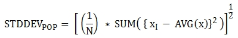
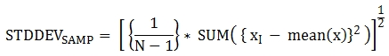
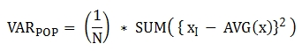

집계 함수
=========

개요
----

집계 함수는 여러행의 값을 입력으로 받아 하나의 값으로 변환하고자 할 때 사용하는 함수이다.

- 집계 함수는 그룹 별로 그룹핑된 결과를 리턴하며, 그룹핑 대상이 되는 칼럼만 출력한다.

- **집계 함수(aggregate function)**는 행들의 그룹에 기반하여 각 그룹 당 하나의 결과를 반환한다. **GROUP BY** 절을 포함하면 각 그룹마다 한 행의 집계 결과를 반환한다. **GROUP BY** 절을 생략하면 전체 행에 대해 한 행의 집계 결과를 반환한다. **HAVING** 절은 **GROUP BY** 절이 있는 질의에 조건을 추가할 때 사용한다.

- 대부분의 집계 함수는 **DISTINCT**, **UNIQUE** 제약 조건을 사용할 수 있다. **GROUP BY ... HAVING** 절에 대해서는 group-by-clause 을 참고한다.

AVG
---

**AVG ([ DISTINCT | DISTINCTROW | UNIQUE | ALL ] expression)**

**AVG** 함수는 집계 함수 또는 분석 함수로 사용되며, 모든 행에 대한 연산식 값의 산술 평균을 구한다. 하나의 연산식 *expression* 만 인자로 지정되며, 연산식 앞에 **DISTINCT** 또는 **UNIQUE** 키워드를 포함시키면 연산식 값 중 중복을 제거한 후 평균을 구하고, 키워드가 생략되거나 **ALL** 인 경우에는 모든 값에 대해서 평균을 구한다.

 - expression: 수치 값을 반환하는 임의의 연산식을 지정한다.
 - ALL: 모든 값에 대해 평균을 구하기 위해 사용되며, 기본값이다.
 - DISTINCT,DISTINCTROW,UNIQUE: 중복이 제거된 유일한 값에 대해서만 평균을 구하기 위해 사용된다.
 - return type: DOUBLE

다음은 *demodb* 에서 한국이 획득한 금메달의 평균 수를 반환하는 예제이다.

``` sql
SELECT AVG(gold)
FROM participant
WHERE nation_code = 'KOR';
```
```
  avg(gold)   
==============
  9.6         
```

COUNT
-----

**COUNT (*)**
**COUNT ([DISTINCT | DISTINCTROW | UNIQUE | ALL] expression)**

**COUNT** 함수는 집계 함수 또는 분석 함수로 사용되며,  질의문이 반환하는 결과 행들의 개수를 반환한다. 별표(\*)를 지정하면 조건을 만족하는 모든 행(**NULL** 값을 가지는 행 포함)의 개수를 반환하며, **DISTINCT** 또는 **UNIQUE** 키워드를 연산식 앞에 지정하면 중복을 제거한 후 유일한 값을 가지는 행(**NULL** 값을 가지는 행은 포함하지 않음)의 개수만 반환한다. 따라서, 반환되는 값은 항상 정수이며, **NULL** 은 반환되지 않는다.

 - expression: 임의의 연산식이다.
 - ALL: 주어진 expression의 모든 행의 개수를 구하기 위해 사용되며, 기본값이다.
 - DISTINCT,DISTINCTROW,UNIQUE: 중복이 제거된 유일한 값을 가지는 행의 개수를 구하기 위해 사용된다.
 - return type: INT

다음은 *demodb* 에서 역대 올림픽 중에서 마스코트가 존재했었던 올림픽의 수를 반환하는 예제이다.

``` sql
SELECT COUNT(*)
FROM olympic
WHERE mascot IS NOT NULL; 
```
```
  count(*)   
=============
  9          
```

GROUP\_CONCAT
-------------

**GROUP_CONCAT([DISTINCT] expression [ORDER BY {column | unsigned_int} [ASC | DESC]] [SEPARATOR str_val])**

**GROUP_CONCAT** 함수는 집계 함수로만 사용되며,  그룹에서 **NULL** 이 아닌 값들을 연결하여 결과 문자열을 **VARCHAR** 타입으로 반환한다. 질의 결과 행이 없거나 **NULL** 값만 있으면 **NULL** 을 반환한다. 
    
 - expression: 수치 또는 문자열을 반환하는 칼럼 또는 연산식
 - str_val: 구분자로 쓰일 문자열
 - DISTINCT: 결과에서 중복되는 값을 제거한다.
 - ORDER BY: 결과 값의 순서를 지정한다.
 - SEPARATOR: 결과 값 사이에 구분할 구분자를 지정한다. 생략하면 기본값인 쉼표(,)를 구분자로 사용한다.
 - return type: STRING

리턴 값의 최대 크기는 시스템 파라미터 **group\_concat\_max\_len** 의 설정을 따른다. 기본값은 **1024** 바이트이며, 최소값은 4바이트, 최대값은 33,554,432바이트이다.

중복되는 값을 제거하려면 **DISTINCT** 절을 사용하면 된다. 그룹 결과의 값 사이에 사용되는 기본 구분자는 쉼표(,)이며, 구분자를 명시적으로 표현하려면 **SEPARATOR** 절과 그 뒤에 구분자로 사용할 문자열을 추가한다. 구분자를 제거하려면 **SEPARATOR** 절 뒤에 빈 문자열(empty string)을 입력한다.

결과 문자열에 문자형 데이터 타입이 아닌 다른 타입이 전달되면, 에러를 반환한다.

**GROUP\_CONCAT** 함수를 사용하려면 다음의 조건을 만족해야 한다.

-   입력 인자로 하나의 표현식(또는 칼럼)만 허용한다.
-   **ORDER BY** 를 이용한 정렬은 오직 인자로 사용되는 표현식(또는 칼럼)에 의해서만 가능하다.
-   구분자로 사용되는 문자열은 문자형 타입만 허용하며, 다른 타입은 허용하지 않는다.

``` sql
SELECT GROUP_CONCAT(s_name) FROM code;
```
```
  group_concat(s_name)   
=========================
  'X,W,M,B,S,G'          
```

``` sql
SELECT GROUP_CONCAT(s_name ORDER BY s_name SEPARATOR ':') FROM code;
```
```
  group_concat(s_name order by s_name separator ':')   
=======================================================
  'B:G:M:S:W:X'                                        
```

``` sql
CREATE GLOBAL TABLE t(i int primary key);
INSERT INTO t VALUES (4),(2),(3),(6),(1),(5);

SELECT GROUP_CONCAT(i*2+1 ORDER BY 1 SEPARATOR '') FROM t;
```
```
  group_concat(i*2+1 order by 1 separator '')   
================================================
  '35791113'                                    
```

MAX
---

**MAX([DISTINCT | DISTINCTROW | UNIQUE | ALL] expression)**

**MAX** 함수는 집계 함수 또는 분석 함수로 사용되며,  모든 행에 대하여 연산식 값 중 최대 값을 구한다. 하나의 연산식 *expression* 만 인자로 지정된다. 문자열을 반환하는 연산식에 대해서는 사전 순서를 기준으로 뒤에 나오는 문자열이 최대 값이 되고, 수치를 반환하는 연산식에 대해서는 크기가 가장 큰 값이 최대 값이다.

 - expression: 수치 또는 문자열을 반환하는 하나의 연산식을 지정한다.
 - ALL: 모든 값에 대해 최대 값을 구하기 위해 사용되며, 기본값이다.
 - DISTINCT,DISTINCTROW,UNIQUE: 중복이 제거된 유일한 값에 대해서 최대 값을 구하기 위해 사용된다.
 return type: expression의 타입

다음은 올림픽 대회 중 한국이 획득한 최대 금메달의 수를 반환하는 예제이다.

``` sql
SELECT MAX(gold) FROM participant WHERE nation_code = 'KOR';
```
```
  max(gold)   
==============
  12          
```

MIN
---

**MIN([DISTINCT | DISTINCTROW | UNIQUE | ALL] expression)**

**MIN** 함수는 집계 함수 또는 분석 함수로 사용되며,  모든 행에 대하여 연산식 값 중 최소 값을 구한다. 하나의 연산식 *expression* 만 인자로 지정된다. 문자열을 반환하는 연산식에 대해서는 사전 순서를 기준으로 앞에 나오는 문자열이 최소 값이 되고, 수치를 반환하는 연산식에 대해서는 크기가 가장 작은 값이 최소 값이다.

 - expression: 수치 또는 문자열을 반환하는 하나의 연산식을 지정한다.
 - ALL: 모든 값에 대해 최소 값을 구하기 위해 사용되며, 기본값이다.
 - DISTINCT,DISTINCTROW,UNIQUE: 중복이 제거된 유일한 값에 대해서 최소 값을 구하기 위해 사용된다.
 - return type: expression의 타입

다음은 *demodb* 에서 올림픽 대회 중 한국이 획득한 최소 금메달의 수를 반환하는 예제이다.

``` sql
SELECT MIN(gold) FROM participant WHERE nation_code = 'KOR';
```
```
  min(gold)   
==============
  7           
```

STDDEV, STDDEV\_POP
-------------------

**STDDEV([DISTINCT | DISTINCTROW | UNIQUE | ALL] expression)**
**STDDEV_POP([DISTINCT | DISTINCTROW | UNIQUE | ALL] expression)**

**STDDEV** 함수와 **STDDEV_POP** 함수는 동일하며, 이 함수는 집계 함수 또는 분석 함수로 사용된다. 이 함수는 모든 행에 대한 연산식 값들에 대한 표준편차, 즉 모표준 편차를 반환한다. **STDDEV_POP** 함수가 SQL:1999 표준이다. 하나의 연산식 *expression* 만 인자로 지정되며, 연산식 앞에 **DISTINCT** 또는 **UNIQUE** 키워드를 포함시키면 연산식 값 중 중복을 제거한 후, 모표준 편차를 구하고, 키워드가 생략되거나 **ALL** 인 경우에는 모든 값에 대해 모표준 편차를 구한다.

 - expression: 수치를 반환하는 하나의 연산식을 지정한다.
 - ALL: 모든 값에 대해 표준 편차를 구하기 위해 사용되며, 기본값이다.
 - DISTINCT,DISTINCTROW,UNIQUE: 중복이 제거된 유일한 값에 대해서만 표준 편차를 구하기 위해 사용된다.
 - return type: DOUBLE

리턴 값은 **VAR\_POP** 함수의 리턴 값의 제곱근과 같으며 **DOUBLE** 타입이다. 결과 계산에 사용할 행이 없으면 **NULL** 을 반환한다.

다음은 함수에 적용된 공식이다.



다음은 전체 과목에 대해 전체 학생의 모표준 편차를 출력하는 예제이다.

``` sql
CREATE GLOBAL TABLE student (id INT PRIMARY KEY, name VARCHAR(32), subjects_id INT, score DOUBLE);
INSERT INTO student VALUES
(1, 'Jane',1, 78), (2, 'Jane',2, 50), (3, 'Jane',3, 60),
(4, 'Bruce', 1, 63), (5, 'Bruce', 2, 50), (6, 'Bruce', 3, 80),
(7, 'Lee', 1, 85), (8, 'Lee', 2, 88), (9, 'Lee', 3, 93),
(10, 'Wane', 1, 32), (11, 'Wane', 2, 42), (12, 'Wane', 3, 99),
(13, 'Sara', 1, 17), (14, 'Sara', 2, 55), (15, 'Sara', 3, 43);

SELECT STDDEV_POP (score) FROM student;
```
```
  stddev_pop(score)   
======================
  23.29711474744362   
```

STDDEV\_SAMP
------------

**STDDEV_SAMP([DISTINCT | DISTINCTROW | UNIQUE | ALL] expression)**

**STDDEV_SAMP** 함수는 집계 함수 또는 분석 함수로 사용되며, 표본 표준편차를 구한다. 하나의 연산식 *expression* 만 인자로 지정되며, 연산식 앞에 **DISTINCT** 또는 **UNIQUE** 키워드를 포함시키면 연산식 값 중 중복을 제거한 후, 표본 표준편차를 구하고, 키워드가 생략되거나 **ALL** 인 경우에는 모든 값에 대해 표본 표준편차를 구한다.

 - expression: 수치를 반환하는 하나의 연산식을 지정한다.
 - ALL: 모든 값에 대해 표준 편차를 구하기 위해 사용되며, 기본값이다.
 - DISTINCT,DISTINCTROW,UNIQUE: 중복이 제거된 유일한 값에 대해서만 표준 편차를 구하기 위해 사용된다.
 - return type: DOUBLE

리턴 값은 **VAR\_SAMP** 함수의 리턴 값의 제곱근과 같으며 **DOUBLE** 타입이다. 결과 계산에 사용할 행이 없으면 **NULL** 을 반환한다.

다음은 함수에 적용된 공식이다.



다음은 전체 과목에 대해 전체 학생의 표본 표준 편차를 출력하는 예제이다.

``` sql
CREATE GLOBAL TABLE student (id INT PRIMARY KEY, name VARCHAR(32), subjects_id INT, score DOUBLE);
INSERT INTO student VALUES
(1, 'Jane',1, 78), (2, 'Jane',2, 50), (3, 'Jane',3, 60),
(4, 'Bruce', 1, 63), (5, 'Bruce', 2, 50), (6, 'Bruce', 3, 80),
(7, 'Lee', 1, 85), (8, 'Lee', 2, 88), (9, 'Lee', 3, 93),
(10, 'Wane', 1, 32), (11, 'Wane', 2, 42), (12, 'Wane', 3, 99),
(13, 'Sara', 1, 17), (14, 'Sara', 2, 55), (15, 'Sara', 3, 43);

SELECT STDDEV_SAMP (score) FROM student;
```
```
    stddev_samp(score)

==========================  
2.411480477888654e+01
```

SUM
---

**SUM ( [ DISTINCT | DISTINCTROW | UNIQUE | ALL ] expression )**

**SUM** 함수는 집계 함수 또는 분석 함수로 사용되며, 모든 행에 대한 연산식 값들의 합계를 반환한다. 하나의 연산식 *expression* 만 인자로 지정되며, 연산식 앞에 **DISTINCT** 또는 **UNIQUE** 키워드를 포함시키면 연산식 값 중 중복을 제거한 후 합계를 구하고, 키워드가 생략되거나 **ALL** 인 경우에는 모든 값에 대해 합계를 구한다. 단일 값 수식을 **SUM** 함수의 입력으로 사용할 수 있다.

 - expression: 수치를 반환하는 하나의 연산식을 지정한다.
 - ALL: 모든 값에 대해 합계를 구하기 위해 사용되며, 기본으로 지정된다.
 - DISTINCT,DISTICNTROW,UNIQUE: 중복이 제거된 유일한 값에 대해서만 합계를 구하기 위해 사용된다.
 - return type: expression의 타입

다음은 *demodb* 에서 역대 올림픽에서 획득한 금메달 수의 합계를 기준으로 10위권 국가와 금메달 총 수를 출력하는 예제이다.

``` sql
SELECT nation_code, SUM(gold) 
FROM participant 
GROUP BY nation_code
ORDER BY SUM(gold) DESC
LIMIT 10;
```
```
  nation_code   sum(gold)   
============================
  'USA'         190         
  'CHN'         97          
  'RUS'         85          
  'GER'         79          
  'URS'         55          
  'FRA'         53          
  'AUS'         52          
  'ITA'         48          
  'KOR'         48          
  'EUN'         45          
```

VARIANCE, VAR\_POP
------------------

**VARIANCE([DISTINCT | DISTINCTROW | UNIQUE | ALL] expression)**
**VAR_POP([DISTINCT | DISTINCTROW | UNIQUE | ALL] expression)**

**VARIANCE** 함수와 **VAR_POP** 함수는 동일하며, 집계 함수 또는 분석 함수로 사용된다. 이 함수는 모든 행에 대한 연산식 값들에 대한 분산, 즉 모분산을 반환한다. 분모는 모든 행의 개수이다. 하나의 연산식 *expression* 만 인자로 지정되며, 연산식 앞에 **DISTINCT** 또는 **UNIQUE** 키워드를 포함시키면 연산식 값 중 중복을 제거한 후, 모분산을 구하고, 키워드가 생략되거나 **ALL** 인 경우에는 모든 값에 대해 모분산을 구한다.

 - expression: 수치를 반환하는 하나의 연산식을 지정한다.
 - ALL: 모든 값에 대해 모분산을 구하기 위해 사용되며, 기본값이다.
 - DISTINCT,DISTINCTROW,UNIQUE: 중복이 제거된 유일한 값에 대해서만 모분산을 구하기 위해 사용된다.
 - return type: DOUBLE

리턴 값은 **DOUBLE** 타입이며, 결과 계산에 사용할 행이 없으면 **NULL** 을 반환한다.

다음은 함수에 적용된 공식이다.



다음은 전체 과목에 대해 전체 학생의 모분산을 출력하는 예제이다.

``` sql
CREATE GLOBAL TABLE student (id INT PRIMARY KEY, name VARCHAR(32), subjects_id INT, score DOUBLE);
INSERT INTO student VALUES
(1, 'Jane',1, 78), (2, 'Jane',2, 50), (3, 'Jane',3, 60),
(4, 'Bruce', 1, 63), (5, 'Bruce', 2, 50), (6, 'Bruce', 3, 80),
(7, 'Lee', 1, 85), (8, 'Lee', 2, 88), (9, 'Lee', 3, 93),
(10, 'Wane', 1, 32), (11, 'Wane', 2, 42), (12, 'Wane', 3, 99),
(13, 'Sara', 1, 17), (14, 'Sara', 2, 55), (15, 'Sara', 3, 43);

SELECT VAR_POP(score) FROM student;
```
```
    var_pop(score)

 ==========================  
 5.427555555555550e+02
```

VAR\_SAMP
---------

**VAR_SAMP([DISTINCT | DISTINCTROW | UNIQUE | ALL] expression)**

**VAR_SAMP** 함수는 집계 함수 또는 분석 함수로 사용되며, 표본 분산을 반환한다. 분모는 모든 행의 개수 - 1이다. 하나의 *expression*\ 만 인자로 지정되며, *expression* 앞에 **DISTINCT** 또는 **UNIQUE** 키워드를 포함시키면 연산식 값 중 중복을 제거한 후, 표본 분산을 구하고, 키워드가 생략되거나 **ALL** 인 경우에는 모든 값에 대해 표본 분산을 구한다.

 - expression: 수치를 반환하는 하나의 연산식을 지정한다.
 - ALL: 모든 값에 대해 표본 분산을 구하기 위해 사용되며, 기본값이다.
 - DISTINCT,DISTINCTROW,UNIQUE: 중복이 제거된 유일한 값에 대해서만 표본 분산을 구하기 위해 사용된다.
 - return type: DOUBLE

리턴 값은 **DOUBLE** 타입이며, 결과 계산에 사용할 행이 없으면 **NULL** 을 반환한다.

다음은 함수에 적용된 공식이다.


다음은 전체 과목에 대해 전체 학생의 표본 분산을 출력하는 예제이다.

``` sql
CREATE GLOBAL TABLE student (id INT PRIMARY KEY, name VARCHAR(32), subjects_id INT, score DOUBLE);
INSERT INTO student VALUES
(1, 'Jane',1, 78), (2, 'Jane',2, 50), (3, 'Jane',3, 60),
(4, 'Bruce', 1, 63), (5, 'Bruce', 2, 50), (6, 'Bruce', 3, 80),
(7, 'Lee', 1, 85), (8, 'Lee', 2, 88), (9, 'Lee', 3, 93),
(10, 'Wane', 1, 32), (11, 'Wane', 2, 42), (12, 'Wane', 3, 99),
(13, 'Sara', 1, 17), (14, 'Sara', 2, 55), (15, 'Sara', 3, 43);     

SELECT VAR_SAMP(score) FROM student;
```
```
    var_samp(score)

 ==========================  
 5.815238095238092e+02
```

